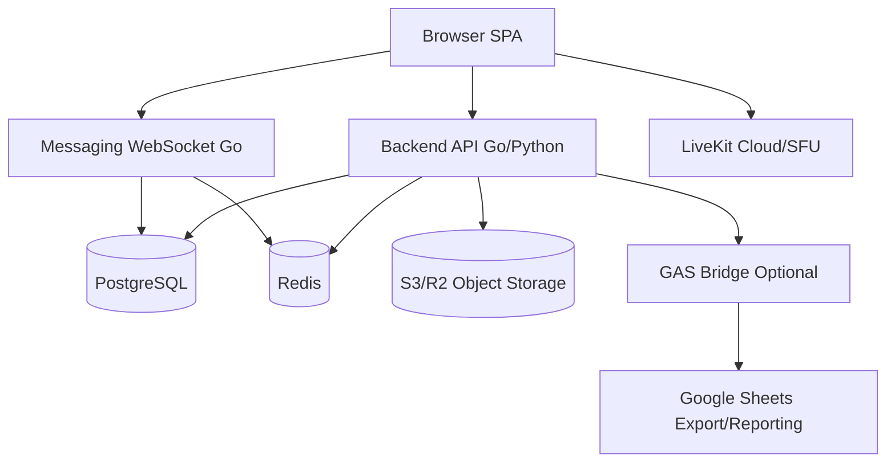

# HerAI Fellowship - Developer Handover & Roadmap

**Tanggal:** 13 Juni 2026  
**Repository:** `woman-in-tech-FIXED`  
**Target pembaca:** programmer lanjutan, maintainer backend/frontend, DevOps, dan technical lead.

Dokumen ini dibuat sebagai pegangan cepat agar programmer lain bisa melanjutkan pengembangan HerAI Fellowship tanpa harus membaca seluruh percakapan implementasi. Dokumentasi pemeliharaan yang lebih panjang sudah ada di `docs/HerAI_Maintenance_Documentation.md`; dokumen ini melengkapi bagian status aktual, batas sistem, dan roadmap pengembangan berikutnya.

## 1. Ringkasan Sistem

HerAI Fellowship saat ini adalah aplikasi event-control panel berbasis SPA dengan beberapa backend:

| Layer | Teknologi | Fungsi Utama |
|---|---|---|
| Frontend SPA | HTML, CSS, vanilla JavaScript | Halaman publik, dashboard admin, tes, pengumuman, profile, meeting, messaging. |
| Development server | Node.js `server.js` | Serve SPA lokal, proxy GAS via `/__gas`, settings lokal, fallback data. |
| Database/API utama | Google Apps Script + Google Sheets | Pendaftaran, peserta, AI screening, stage, audit, competency, retest, project, certificate, assets. |
| Meeting backend | Go `signaling/` | Signaling WebRTC, room monitor, LiveKit token/config, static production service di Render. |
| Messaging backend | Go `messaging/` | Login/register chat, friends, rooms, WebSocket messaging, message persistence JSON dev, validation backend. |
| Deployment | Render blueprint `render.yaml` | Service `herai-signaling` dan `herai-messaging`. |

Prinsip saat ini: UI tetap di browser, tetapi logic yang sensitif atau mudah dimanipulasi mulai dipindahkan ke backend. Contoh yang sudah dipindahkan adalah validasi register messaging, validasi role, validasi lampiran, config limit lampiran, GAS proxy, dan token LiveKit.

## 2. Cara Menjalankan Lokal

### 2.1 Frontend SPA

```bash
cd /Users/marchelandrianshevchenko/Downloads/woman-in-tech-FIXED
node server.js
```

Alternatif static-only:

```bash
python3 -m http.server 3000
```

URL lokal:

```text
http://127.0.0.1:3000/#/home
http://127.0.0.1:3000/#/dashboard
http://127.0.0.1:3000/#/messaging
http://127.0.0.1:3000/#/meeting
```

Catatan: `server.js` lebih disarankan daripada Python static server karena menyediakan `/__gas` dan `/__settings`.

### 2.2 Google Apps Script

File utama:

```text
gas/Code.gs
```

Langkah setup:

1. Buka Google Spreadsheet target.
2. Buka `Extensions > Apps Script`.
3. Paste isi `gas/Code.gs`.
4. Pastikan `SPREADSHEET_ID` mengarah ke spreadsheet produksi/development yang benar.
5. Jalankan `setupDatabase()` sekali.
6. Deploy sebagai Web App dengan akses `Anyone with link`.
7. Set `GAS_WEB_APP_URL` di Render atau environment lokal bila URL berubah.

### 2.3 Meeting Signaling / LiveKit Gateway

```bash
cd signaling
go run .
```

Default:

```text
http://127.0.0.1:8080/healthz
ws://127.0.0.1:8080/ws
```

Environment penting:

```text
GAS_WEB_APP_URL
APP_ACCESS_PASSWORD
HERAI_ICE_SERVERS
LIVEKIT_URL
LIVEKIT_API_KEY
LIVEKIT_API_SECRET
HERAI_STATIC_ROOT
```

### 2.4 Messaging Backend

```bash
cd messaging
go run .
```

Default:

```text
http://127.0.0.1:8091/healthz
http://127.0.0.1:8091/api/config
```

Environment penting:

```text
PORT
MESSAGING_PORT
MESSAGING_DATA_FILE
```

Untuk Render, `MESSAGING_DATA_FILE` diarahkan ke disk:

```text
/var/data/herai-messaging-data.json
```

## 3. Struktur File Penting

| Area | File/Folder | Keterangan |
|---|---|---|
| SPA shell | `index.html` | Memuat semua CSS/JS dan container route. |
| Router | `js/router.js` | Hash routing, admin layout, alias route, sidebar cache. |
| Components | `components/` | Navbar, sidebar, footer. |
| Public pages | `pages/frontend/` | Home, register, announcement, profile, competency, retest, meeting, messaging, projects. |
| Dashboard pages | `pages/dashboard/` | Dashboard admin, scoring, AI, anti-fraud, monitor, settings, RBAC, assets. |
| Public JS | `js/frontend/` | Logic halaman peserta/publik. |
| Dashboard JS | `js/dashboard/` | Logic modul admin. |
| GAS | `gas/Code.gs` | Schema Google Sheets dan action router. |
| Meeting Go | `signaling/main.go` | Signaling, LiveKit token/config, rooms monitor, static serve Render. |
| Messaging Go | `messaging/main.go` | Chat backend, WebSocket, users, rooms, friends, messages. |
| Messaging schema | `messaging/schema.sql` | Draft schema PostgreSQL untuk migrasi production. |
| Deploy config | `render.yaml` | Blueprint Render untuk signaling dan messaging. |

## 4. Route dan Modul Utama

### 4.1 Public/Peserta

| Route | Modul | Status |
|---|---|---|
| `#/home` | Landing page | Aktif |
| `#/register` | Pendaftaran peserta | Aktif |
| `#/announcement` | Pengumuman umum | Aktif |
| `#/announcement-stage-1` | Pengumuman lolos tahap 1 | Aktif |
| `#/announcement-stage-2` | Pengumuman final/tahap 2 | Aktif |
| `#/profile` | Profile peserta | Aktif, data detail masih bisa dipilih untuk disembunyikan |
| `#/competency-test` | Tes kompetensi peserta | Aktif |
| `#/retest` | Re-Test peserta | Aktif |
| `#/projects` | Submission final project | Aktif/foundation |
| `#/meeting` | Meeting peserta/admin | Aktif, perlu hardening skala |
| `#/messaging` | Chat/messaging | Aktif development |

### 4.2 Dashboard/Admin

| Route | Modul | Status |
|---|---|---|
| `#/dashboard` | Overview control panel | Aktif |
| `#/stage-control` | Kontrol tahapan acara | Aktif/foundation |
| `#/ai-prescreening` | AI Pre-Screening | Aktif |
| `#/skoring` | Sistem skoring tahap 1 | Aktif |
| `#/competency-monitor` | Monitor tahap 2 | Aktif |
| `#/retest-monitor` | Monitor Re-Test | Aktif |
| `#/data-visualization` | Visualisasi data | Aktif/foundation |
| `#/video-conference` | Room control dan meeting monitor | Aktif |
| `#/anti-fraud` | Deteksi duplicate pendaftar | Aktif/foundation |
| `#/global-settings` | Settings acara | Aktif |
| `#/rbac` | Role admin/access control | Aktif/foundation |
| `#/assets` | Assets & links | Aktif/foundation |
| `#/bootcamp` | Bootcamp control | Aktif/foundation |
| `#/final-project` | Final project tracker | Aktif/foundation |
| `#/certificates` | Certificate manager | Aktif/foundation |
| `#/audit-trail` | Log aktivitas admin | Aktif |

## 5. Database Google Sheets

Schema utama berada di `SCHEMA` dalam `gas/Code.gs`.

### 5.1 Sheet Utama

| Sheet | Fungsi |
|---|---|
| `peserta_tahap_1` | Database utama peserta dan status seleksi. |
| `dashboard_admin` | Akun admin, password, role, permissions, status. |
| `AuditTrail` | Log tindakan admin. |
| `Settings` | Global settings aplikasi. |
| `Stages` | Status tahapan event. |
| `CompetencyQuestions` | Bank soal tahap 2/Re-Test. |
| `CompetencySessions` | Session pengerjaan tahap 2. |
| `ReTestAccess` | Akses NIK + kode unik Re-Test. |
| `ReTestSessions` | Session pengerjaan Re-Test. |
| `ai-screening-result` | Hasil AI Pre-Screening. |
| `FinalProjects` | Submission final project. |
| `Certificates` | Data sertifikat. |
| `Assets` | Link dan aset acara. |

### 5.2 Kontrak Action GAS

Semua request utama dikirim dengan POST JSON:

```json
{
  "action": "namaAction",
  "payload_lain": "..."
}
```

Respons standar:

```json
{
  "status": "success",
  "data": []
}
```

Respons error:

```json
{
  "status": "error",
  "message": "..."
}
```

Action penting:

| Action | Fungsi |
|---|---|
| `register` | Simpan pendaftaran peserta. |
| `participantLogin` | Login profile peserta. |
| `setParticipantPassword` | Buat password peserta. |
| `updateParticipantProfile` | Update profile peserta. |
| `getData` | Ambil peserta + AI screening. |
| `updateStatus` | Update status tahap 1. |
| `updateScore` | Update skor manual. |
| `runAiAnalysis` | Jalankan AI Pre-Screening. |
| `login` | Login admin. |
| `getAuditData` | Ambil audit trail. |
| `getSettings` / `saveSettings` | Global settings. |
| `getCompetencyQuestions` | Ambil soal tahap 2. |
| `startCompetencySession` | Mulai sesi tahap 2. |
| `heartbeatCompetencySession` | Auto-save/proctoring tahap 2. |
| `submitCompetencyTest` | Submit tahap 2. |
| `updateCompetencyDecision` | Decision final/tahap 2. |
| `getReTestAccess` | Daftar akses Re-Test. |
| `generateReTestAccess` | Generate kode unik Re-Test. |
| `retestLogin` | Login Re-Test. |
| `submitReTest` | Submit Re-Test. |
| `submitFinalProject` | Submit project akhir. |
| `saveAsset` | Simpan asset/link. |

## 6. Backend Go Messaging

Folder:

```text
messaging/
```

Endpoint utama:

| Endpoint | Method | Fungsi |
|---|---|---|
| `/healthz` | GET | Health check service. |
| `/api/config` | GET | Allowed roles, limit attachment, kind attachment. |
| `/api/register/validate` | POST | Validasi step awal daftar. |
| `/api/register` | POST | Register final dengan role dan public key. |
| `/api/login` | POST | Login user messaging. |
| `/api/users` | GET | Ambil user relevan. |
| `/api/friends` | GET/POST | Daftar/tambah teman by ID. |
| `/api/rooms` | GET/POST | Daftar/buat room. |
| `/api/rooms/{id}` | GET | Detail room + messages. |
| `/api/rooms/{id}/messages` | POST | Kirim pesan REST fallback. |
| `/ws` | WS | Real-time events. |

Fitur yang sudah ada:

- Register/login user messaging.
- Role: `fellow`, `mentor`, `volunteer`, `partner`.
- Tambah teman by ID.
- Chat 1-on-1 dan group.
- Online presence.
- WebSocket real-time event.
- REST fallback untuk kirim pesan.
- Validasi message/attachment di backend.
- Penyimpanan development ke JSON.
- E2EE foundation di browser dengan WebCrypto.

Catatan penting:

- Password saat ini masih sederhana dan harus diganti ke hashing kuat sebelum production.
- Persistence JSON cocok untuk development, bukan production.
- E2EE masih foundation, belum Signal Protocol.
- File attachment masih dikirim sebagai payload terenkripsi/base64 di client; perlu object storage untuk production.

## 7. Backend Go Meeting / Signaling

Folder:

```text
signaling/
```

Endpoint utama:

| Endpoint | Method | Fungsi |
|---|---|---|
| `/healthz` | GET | Health check service. |
| `/rooms` | GET | Monitor room aktif lokal/LiveKit. |
| `/rooms?room=...` | DELETE | Hapus room lokal/LiveKit. |
| `/meeting-config` | GET | Config transport meeting, LiveKit, ICE servers. |
| `/livekit-token` | GET/POST | Generate token LiveKit. |
| `/ws` | WS | Signaling fallback/P2P. |
| `/__gas` | POST | Proxy GAS dari service Render. |
| `/__app-auth` | POST | Password gate production app. |

Status:

- Service sudah bisa serve static app di Render melalui `HERAI_STATIC_ROOT`.
- Jika LiveKit env lengkap, transport diarahkan ke LiveKit.
- Jika LiveKit env tidak ada, fallback P2P/signaling masih tersedia.
- Untuk 30-50 user, LiveKit/SFU harus menjadi jalur utama.

## 8. Fitur yang Sudah Ada

### 8.1 Event & Seleksi

- Pendaftaran peserta.
- Database pendaftar.
- Profile peserta.
- Login peserta NIK/password.
- Stage control acara.
- Global settings.
- Announcement countdown.
- Pengumuman tahap 1.
- Pengumuman final/tahap 2.
- AI Pre-Screening.
- Leaderboard seleksi.
- Skoring manual.
- Decision lolos/tidak lolos.
- Audit trail admin.
- RBAC admin foundation.
- Anti-duplicate pendaftar.

### 8.2 Competency Test & Re-Test

- Tes tahap 2 dengan section Math, Logic, Psikologi.
- Timer per section.
- Auto-save jawaban.
- Section lock.
- Submit final.
- Dashboard live monitor.
- Weighted score foundation.
- Decision panitia.
- Re-Test dengan NIK + kode unik.
- Generate kode akses Re-Test.
- Live Re-Test dashboard.

### 8.3 Projects, Bootcamp, Certificate

- Halaman projects.
- Submission final project.
- Field project seperti deck, repo, demo, overview, members, track, institution.
- Bootcamp control foundation.
- Final project tracker foundation.
- Certificate manager foundation.

### 8.4 Meeting

- Generate room meeting.
- Join by code/link.
- Preview kamera/mic.
- Toggle mic/camera.
- Screen share.
- Raise hand.
- Participant list.
- Chat meeting.
- Reaction/emoji foundation.
- Room server monitor.
- LiveKit token/config foundation.

### 8.5 Messaging

- Login/register messaging.
- UI auth HerAI.
- Role selection setelah daftar.
- Tambah teman by ID.
- Chat 1-on-1.
- Group chat.
- Online/offline status.
- Attachment image/document/video.
- Preview attachment.
- Emoji.
- Incoming call UI.
- Voice/video call UI foundation.
- WebSocket messaging.
- Backend validation di Go.

## 9. Batasan Saat Ini

Bagian ini penting agar programmer lanjutan tidak menganggap semua modul sudah production-grade.

| Area | Batasan |
|---|---|
| GAS/Sheets | Cocok untuk event ops dan MVP, tetapi rawan limit jika traffic tinggi. |
| AI Pre-Screening | Harus batch/rate-limit agar tidak terkena limit API dan GAS. |
| Competency Test | Perlu audit scoring dan locking tambahan untuk high-stakes exam. |
| Meeting | P2P tidak cocok untuk 30-50 user; LiveKit/SFU wajib untuk skala itu. |
| Messaging | Persistence JSON belum cukup untuk production; perlu PostgreSQL + Redis. |
| Password | Beberapa modul masih memakai mekanisme sederhana; perlu hashing dan session/token yang benar. |
| RBAC | UI restriction sudah ada, tetapi semua enforcement sensitif harus ada di backend. |
| Attachment | Perlu object storage dan antivirus/content validation sebelum production. |
| E2EE | WebCrypto foundation belum setara protocol messaging modern. |
| Observability | Belum ada centralized logs, metrics, tracing, alerting. |

## 10. Roadmap Pengembangan Berikutnya

### Prioritas 0 - Keamanan dan Data Integrity

1. Pindahkan semua validasi penting dari JS ke backend.
2. Terapkan password hashing:
   - Go: `bcrypt` atau `argon2id`.
   - GAS: minimal hash + salt jika masih digunakan, tapi idealnya auth pindah backend.
3. Buat session/token backend dengan expiry.
4. Jangan simpan secret di frontend.
5. Tambahkan permission check backend untuk semua action admin.
6. Buat audit trail konsisten untuk semua perubahan data penting.
7. Batasi CORS sesuai domain production.
8. Tambahkan rate limiting untuk login, register, AI, dan test heartbeat.

### Prioritas 1 - Migrasi Database Production

Disarankan menambah backend utama Go/Python dengan PostgreSQL:

| Modul | Target Storage |
|---|---|
| Participants | PostgreSQL |
| Admin/RBAC | PostgreSQL |
| Competency sessions | PostgreSQL |
| Re-Test sessions | PostgreSQL |
| Messaging users/rooms/messages | PostgreSQL |
| Presence/chat event | Redis |
| Attachments | S3-compatible object storage |
| Audit trail | PostgreSQL append-only table |

Google Sheets bisa tetap menjadi admin-export/reporting, bukan database utama.

### Prioritas 2 - Messaging Production

1. Implement PostgreSQL schema dari `messaging/schema.sql`.
2. Tambahkan migration tool.
3. Simpan password dengan hash.
4. Gunakan Redis Pub/Sub untuk multi-instance WebSocket.
5. Implement delivery receipt dan read receipt yang konsisten.
6. Buat object storage untuk attachment.
7. Tambahkan thumbnail generation untuk image/video.
8. Implement real WebRTC call signaling atau integrasi LiveKit call.
9. Tambahkan block/report user.
10. Tambahkan group membership management.

### Prioritas 3 - Meeting 30-50 User Stabil

1. Jadikan LiveKit/SFU sebagai default production.
2. Hapus ketergantungan P2P untuk meeting besar.
3. Tambahkan role host/co-host/participant.
4. Host control:
   - mute participant,
   - remove participant,
   - lock room,
   - allow screen share,
   - end meeting.
5. Tambahkan TURN server berbayar/reliable.
6. Tambahkan monitoring bitrate, packet loss, reconnect count.
7. Simpan room history dan participant join/leave.
8. Uji beban 10, 20, 30, 50 user dengan skenario nyata.

### Prioritas 4 - Competency Test Hardening

1. Simpan jawaban per nomor secara atomic di backend.
2. Tambahkan server-side timer authority.
3. Jangan percaya timer dari browser.
4. Tambahkan submit idempotency.
5. Tambahkan scoring server-side final.
6. Buat versioning paket soal.
7. Log semua perubahan jawaban.
8. Tambahkan export hasil penilaian.
9. Tambahkan conflict resolution saat peserta reload/multiple tab.

### Prioritas 5 - AI Pre-Screening

1. Buat job queue untuk AI screening.
2. Jalankan batch, bukan scan massal blocking dari browser.
3. Tambahkan retry dan backoff.
4. Simpan prompt version.
5. Simpan structured scoring:
   - logic,
   - motivation,
   - technical,
   - background,
   - overall.
6. Tambahkan reviewer override history.
7. Buat normalized score agar leaderboard konsisten.

### Prioritas 6 - Data Visualization

1. Validasi sumber data setiap chart.
2. Tambahkan filter:
   - tahap,
   - status,
   - provinsi,
   - kampus,
   - latar belakang,
   - skor range.
3. Tambahkan export CSV/PDF.
4. Tambahkan peta Indonesia dengan koordinat provinsi.
5. Buat dashboard decision-ready untuk panitia.

### Prioritas 7 - Developer Experience

1. Tambahkan `package.json` untuk script standar:
   - `dev`,
   - `lint`,
   - `test`,
   - `build`.
2. Tambahkan Makefile untuk Go services.
3. Tambahkan `.env.example`.
4. Tambahkan automated smoke test.
5. Tambahkan CI GitHub Actions.
6. Tambahkan Playwright untuk UI regression.
7. Tambahkan test GAS action dengan payload sample.

## 11. Usulan Arsitektur Lanjutan

Untuk jangka menengah, sistem sebaiknya bergerak ke arsitektur berikut:



Rekomendasi pembagian:

| Komponen | Bahasa yang Disarankan | Alasan |
|---|---|---|
| Realtime messaging | Go | WebSocket concurrency dan performance bagus. |
| Meeting gateway/token | Go | Sudah ada dan cocok untuk LiveKit/token service. |
| Core event API | Go atau Python FastAPI | Go untuk performa, Python untuk analytics/AI workflow. |
| AI scoring worker | Python | Ekosistem AI dan data processing lebih nyaman. |
| Analytics/reporting | Python | Pandas, chart/export lebih kuat. |
| Frontend | JS tetap perlu | UI, WebCrypto, camera, file picker, WebRTC harus di browser. |

## 12. Environment Variable Checklist

### Frontend/Node Dev Server

```text
PORT=3000
HOST=127.0.0.1
GAS_WEB_APP_URL=https://script.google.com/macros/s/.../exec
```

### Signaling/Meeting

```text
PORT=8080
HERAI_STATIC_ROOT=./public
GAS_WEB_APP_URL=https://script.google.com/macros/s/.../exec
APP_ACCESS_PASSWORD=isi-di-render
HERAI_ICE_SERVERS=[{"urls":"turn:...","username":"...","credential":"..."}]
LIVEKIT_URL=wss://...
LIVEKIT_API_KEY=...
LIVEKIT_API_SECRET=...
```

### Messaging

```text
PORT=8091
MESSAGING_DATA_FILE=/var/data/herai-messaging-data.json
```

Catatan: jangan commit secret ke repository. Set secret melalui Render Environment, GitHub Actions Secret, atau secret manager.

## 13. Checklist Sebelum Programmer Baru Mulai

1. Clone repo development yang benar.
2. Jalankan SPA dengan `node server.js`.
3. Jalankan `cd signaling && go run .`.
4. Jalankan `cd messaging && go run .`.
5. Cek `gas/Code.gs` sudah sama dengan Apps Script deployment.
6. Cek `GAS_WEB_APP_URL` aktif.
7. Buka `#/dashboard`, `#/competency-monitor`, `#/retest-monitor`, `#/messaging`, dan `#/meeting`.
8. Jalankan smoke test manual:
   - register peserta,
   - login admin,
   - getData dari GAS,
   - start test/retest,
   - create meeting room,
   - login messaging,
   - add friend,
   - send message.
9. Catat error console dan network tab.
10. Jangan mengubah schema sheet tanpa update `SCHEMA` di `gas/Code.gs`.

## 14. Definition of Done untuk Fitur Baru

Fitur dianggap selesai jika:

1. UI responsive desktop/mobile.
2. Logic sensitif tidak hanya berada di JS.
3. Backend memvalidasi payload.
4. Error state jelas untuk user.
5. Loading state tidak mengunci UI.
6. Ada audit trail untuk perubahan data penting.
7. Data tersimpan dan bisa dibaca ulang.
8. Route aman terhadap refresh.
9. Tidak ada secret di frontend.
10. Minimal ada smoke test manual yang terdokumentasi.

## 15. Risiko Teknis Utama

| Risiko | Dampak | Mitigasi |
|---|---|---|
| Google Sheets timeout | Dashboard/test gagal load | Cache, pagination, backend DB, retry terbatas. |
| GAS quota limit | AI/test heartbeat terganggu | Batch queue, rate limit, pindah backend. |
| P2P meeting banyak user | Video/audio freeze | LiveKit/SFU + TURN. |
| Secret bocor di JS | Abuse API/database | Pindah secret ke backend env. |
| Auth client-side | Admin bypass | Enforce RBAC backend. |
| Attachment base64 besar | Memory/browser berat | Object storage + signed URL. |
| JSON persistence messaging | Data hilang/korup | PostgreSQL + backup. |

## 16. Backlog Ringkas

### Must Have

- Backend auth proper untuk admin dan peserta.
- PostgreSQL untuk data kritis.
- Redis untuk realtime/presence.
- LiveKit sebagai default meeting production.
- Server-side scoring competency/retest.
- RBAC enforced di backend.
- Object storage untuk attachment/project files.

### Should Have

- CI/CD dan smoke test.
- Export data visualisasi.
- Audit trail lengkap.
- AI screening job queue.
- Monitoring Render/LiveKit.
- Error reporting frontend.

### Could Have

- Mobile app wrapper.
- Push notification.
- Certificate PDF generator otomatis.
- Advanced analytics.
- Mentor assignment workflow.
- Alumni/community portal.

## 17. File Referensi

- Dokumentasi utama: `docs/HerAI_Maintenance_Documentation.md`
- Panduan scoring admin: `docs/admin-selection-scoring-guide.md`
- Arsitektur meeting: `docs/video-conference-architecture.md`
- Visual arsitektur: `docs/system-architecture-visual.md`
- GAS backend: `gas/Code.gs`
- SPA router: `js/router.js`
- Node dev server: `server.js`
- Meeting service: `signaling/main.go`
- Messaging service: `messaging/main.go`
- Render deploy: `render.yaml`

