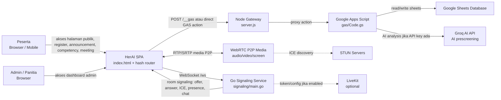
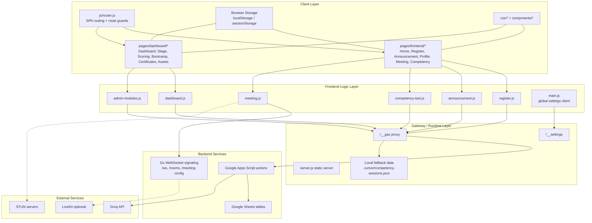
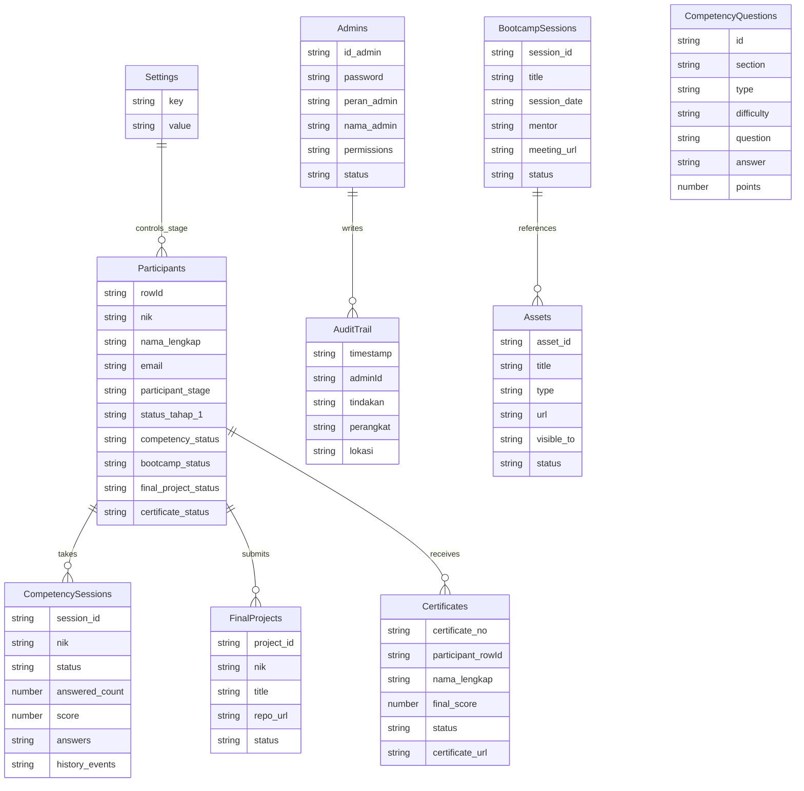
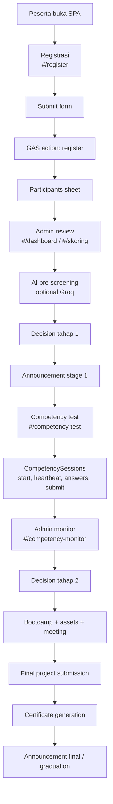
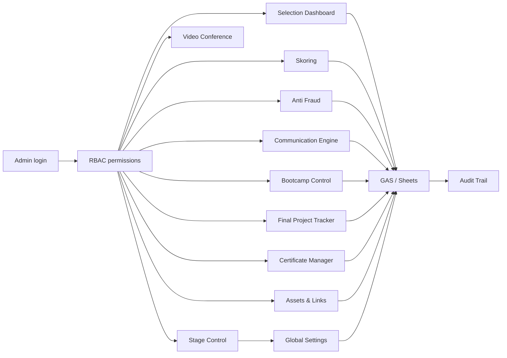
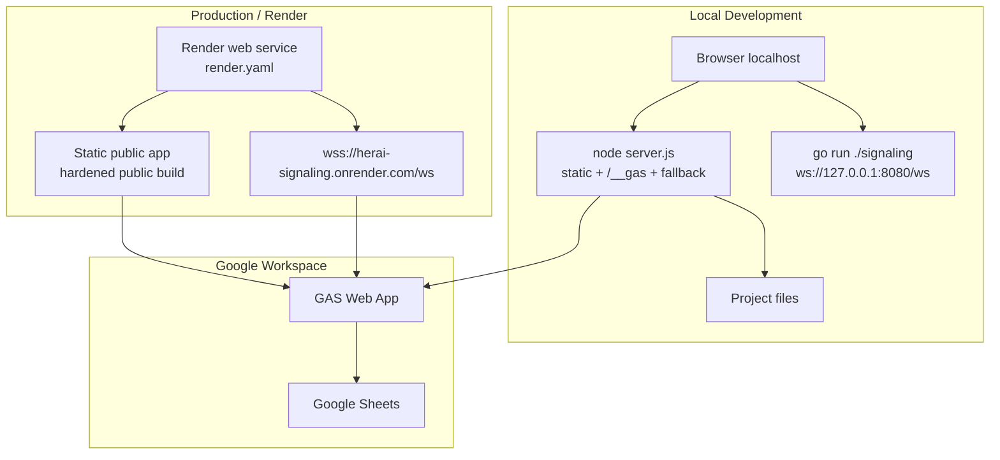

# Visual Arsitektur Sistem HerAI

Dokumen ini menggambarkan arsitektur sistem HerAI Fellowship 2026 yang dibangun di repo ini.

## 1. System Context

## 2. Layered Architecture

## 3. Data Store Map

## 4. Main Operational Flow

## 5. Admin Control Plane

## 6. Deployment View

## 7. Ringkasan Tanggung Jawab Komponen

| Komponen | Tanggung jawab |
| --- | --- |
| `index.html` + `js/router.js` | Entry point SPA, hash routing, route guard, load partial page. |
| `pages/frontend/*` | UI peserta dan halaman publik. |
| `pages/dashboard/*` | UI admin control panel. |
| `js/frontend/*` | Logic peserta: register, announcement, profile, meeting, competency, projects. |
| `js/dashboard/*` | Logic admin: login, selection, scoring, monitor, modules, audit. |
| `server.js` | Static server, `/__gas` proxy, `/__settings`, fallback lokal untuk beberapa action. |
| `gas/Code.gs` | Backend utama berbasis Google Apps Script untuk action dan schema Sheets. |
| Google Sheets | Database operasional: peserta, admin, settings, competency, assets, certificates. |
| `signaling/main.go` | WebSocket signaling video conference, room monitor, LiveKit token/config optional. |
| `render.yaml` | Build/deploy service Go + public static app ke Render. |

