# Arsitektur Video Conference HerAI

Dokumen ini hanya membahas arsitektur fitur **Video Conference** yang ada di sistem HerAI.

## 1. High-Level Architecture

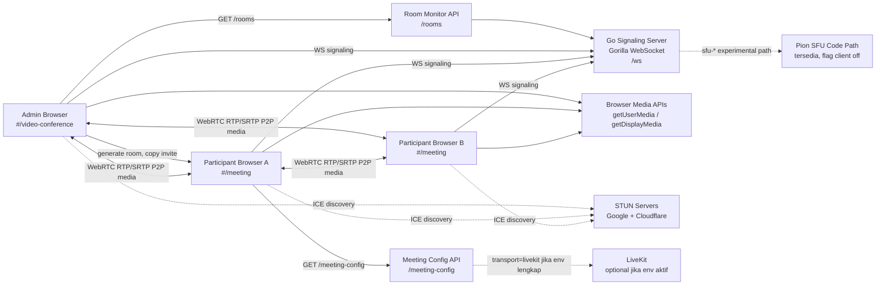

**Jalur aktif default:** WebRTC **P2P mesh**.  
**Fungsi server Go:** signaling, room registry, monitoring room, optional LiveKit token/config, optional SFU path.  
**Media audio/video:** tidak lewat WebSocket; media berjalan langsung antar browser lewat WebRTC.

## 2. Protocol Stack Punya Kita

Diagram ini adalah versi HerAI dari contoh protocol stack WebRTC yang kamu kirim.

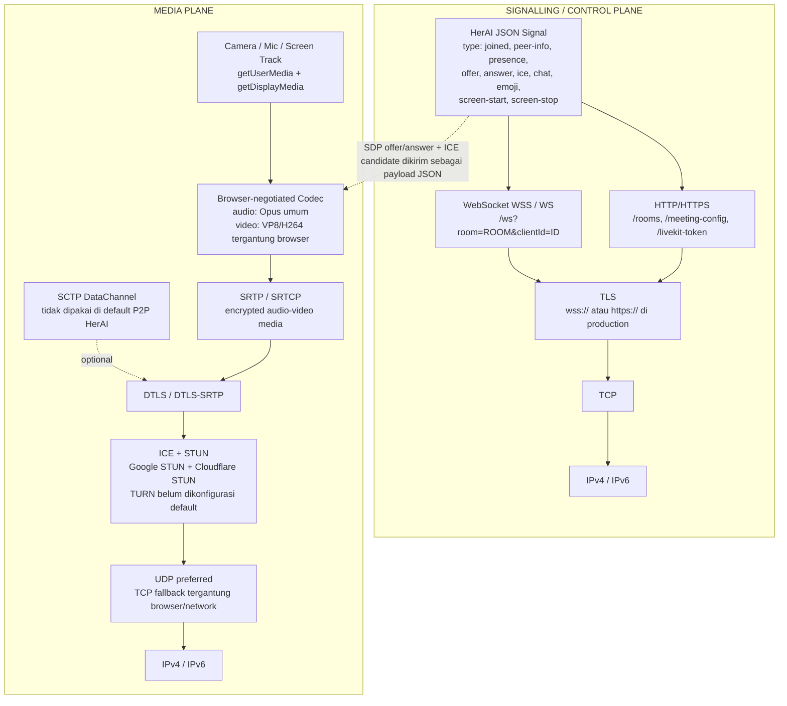

Ringkasnya:

| Area | Punya HerAI |
| --- | --- |
| Signaling transport | `WebSocket` lewat endpoint `/ws`. Production memakai `wss://`. |
| Signaling payload | JSON custom berisi `offer`, `answer`, `ice`, `presence`, `chat`, `emoji`, dan event screen share. |
| SDP | Dibuat browser lewat `RTCPeerConnection.createOffer()` / `createAnswer()`, lalu dikirim via WebSocket. |
| ICE | Candidate dikirim via WebSocket type `ice`; STUN default: Google dan Cloudflare. |
| TURN | Belum ada default TURN server di kode. Bisa ditambahkan lewat env `HERAI_ICE_SERVERS`. |
| Media | WebRTC P2P mesh antar browser, bukan lewat server Go. |
| Media encryption | WebRTC memakai DTLS-SRTP, sehingga audio/video terenkripsi antar peer. |
| Codec | Tidak dipaksa manual; dinegosiasikan browser. Umumnya Opus untuk audio, VP8/H264 untuk video. |
| SCTP/DataChannel | Tidak dipakai di mode P2P default. Chat, emoji, dan presence dikirim lewat WebSocket signaling. |
| LiveKit optional | Kalau LiveKit aktif, data meeting bisa lewat LiveKit data publish dan media lewat LiveKit SFU. |

## 3. Protocol Flow P2P

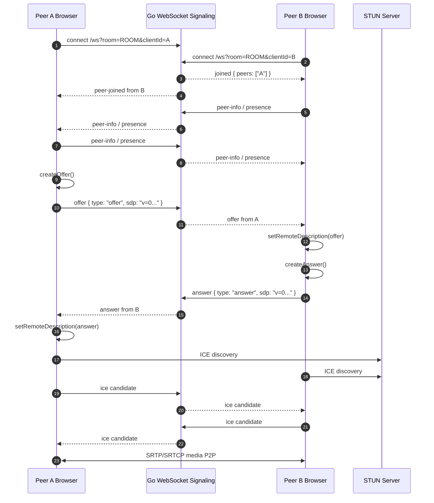

## 4. Network Path Yang Sebenarnya

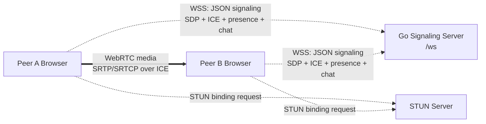

Jadi server Go **tidak menjadi media relay** pada mode default. Kalau NAT peserta tidak bisa ditembus STUN dan tidak ada TURN, koneksi media bisa gagal walaupun WebSocket signaling berhasil.

## 5. Komponen Yang Dibangun

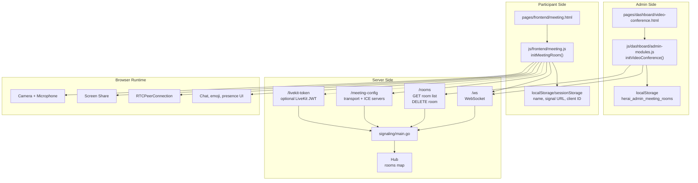

## 6. Admin Generate Room

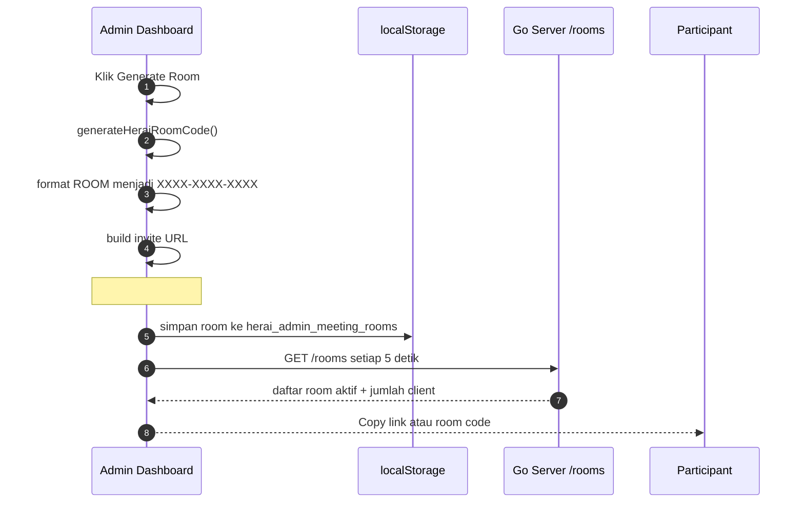

## 7. Participant Join Room

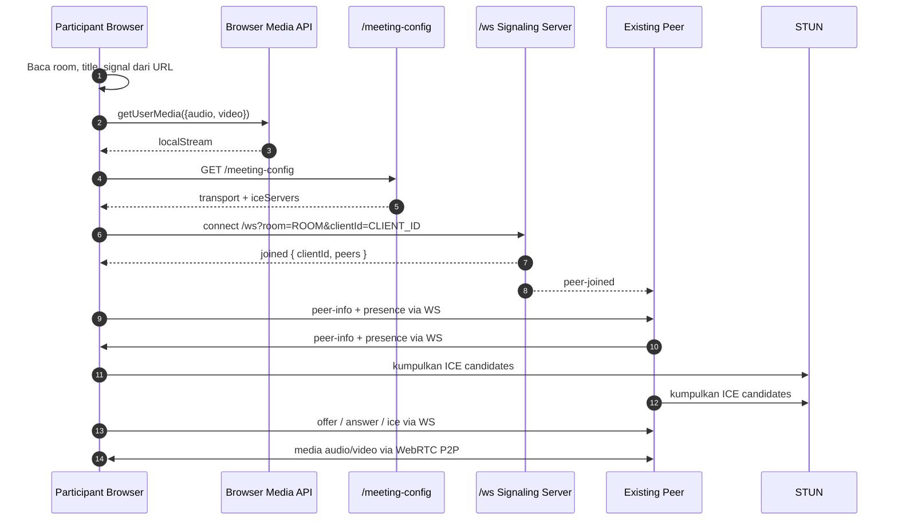

## 8. Signaling Server Flow

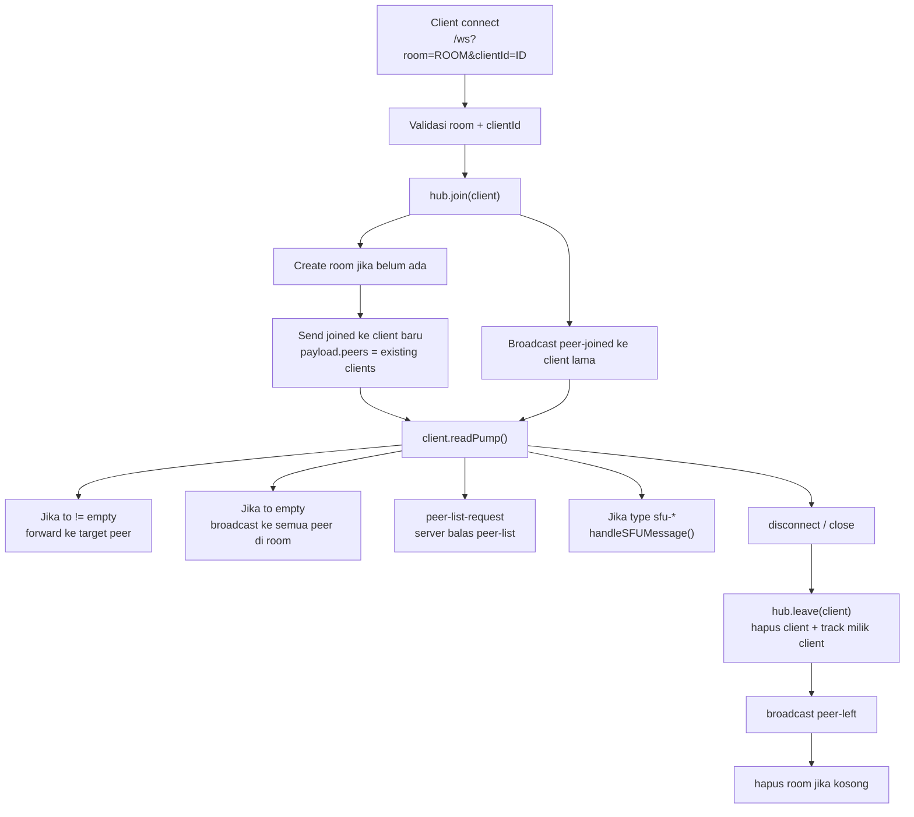

## 9. P2P Mesh Media Topology

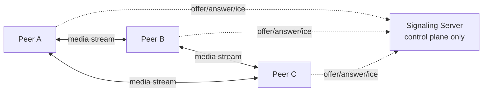

Dalam mode default, setiap peer membuat koneksi WebRTC ke setiap peer lain. Kalau ada 3 peserta, terbentuk 3 koneksi media. Kalau ada 4 peserta, terbentuk 6 koneksi media.

## 10. Payload WebSocket

Envelope umum:

```json
{
  "type": "presence",
  "room": "ABCD-EFGH-JK2M",
  "from": "diisi server",
  "to": "target-peer-id atau kosong",
  "payload": {}
}
```

Payload yang dipakai:

| Type | Arah | Fungsi | Payload |
| --- | --- | --- | --- |
| `joined` | server -> client baru | client berhasil masuk room | `{ "clientId": "...", "peers": ["peer-id"] }` |
| `peer-joined` | server -> peer lama | notifikasi peer baru masuk | kosong |
| `peer-left` | server -> peer lain | notifikasi peer keluar | kosong |
| `peer-info` | client -> peer/broadcast | sinkron nama peserta | `{ "name": "Nama" }` |
| `presence` | client -> peer/broadcast | status peserta | `{ "id": "...", "name": "...", "mic": true, "camera": true, "hand": false, "screen": false }` |
| `peer-list-request` | client -> server | audit mesh berkala | `{ "name": "Nama" }` |
| `peer-list` | server -> client | daftar peer aktif | `{ "peers": ["peer-id"] }` |
| `offer` | client -> peer | SDP offer WebRTC | `{ "type": "offer", "sdp": "v=0..." }` |
| `answer` | client -> peer | SDP answer WebRTC | `{ "type": "answer", "sdp": "v=0..." }` |
| `ice` | client -> peer | ICE candidate | `{ "candidate": "...", "sdpMid": "0", "sdpMLineIndex": 0 }` |
| `media-reconnect` | client -> peer | minta renegosiasi media | `{ "name": "Nama" }` |
| `screen-start` | client -> broadcast | mulai screen share | `{ "name": "Nama", "streamId": "..." }` |
| `screen-stop` | client -> broadcast | stop screen share | `{ "name": "Nama" }` |
| `chat` | client -> broadcast | pesan chat | `{ "name": "Nama", "text": "pesan", "at": "2026-05-21T..." }` |
| `emoji` | client -> broadcast | reaction | `{ "emoji": "👍", "name": "Nama" }` |
| `room-deleted` | server -> room clients | admin menutup room | `{ "message": "Room ditutup oleh admin" }` |

## 11. HTTP API Video Conference

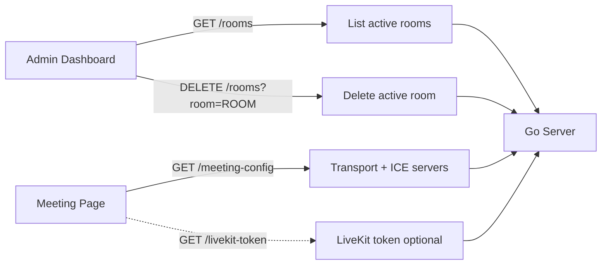

Contoh response `/meeting-config`:

```json
{
  "ok": true,
  "transport": "p2p",
  "livekit": {
    "enabled": false,
    "url": ""
  },
  "iceServers": [
    { "urls": "stun:stun.l.google.com:19302" },
    { "urls": "stun:stun1.l.google.com:19302" },
    { "urls": "stun:stun.cloudflare.com:3478" }
  ]
}
```

Contoh response `/rooms`:

```json
{
  "ok": true,
  "rooms": [
    {
      "room": "ABCD-EFGH-JK2M",
      "clients": 2,
      "peers": ["client-a", "client-b"],
      "transport": "websocket"
    }
  ]
}
```

## 12. Screen Share Flow

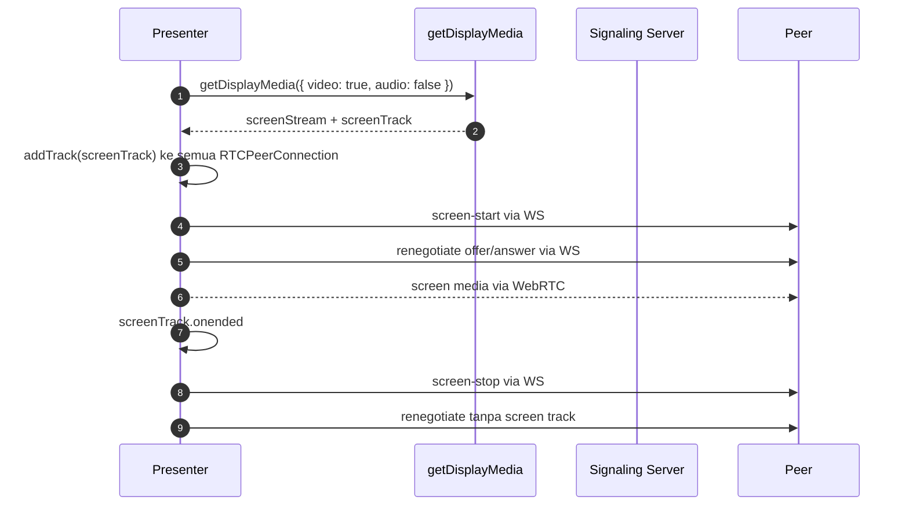

## 13. Mode Transport

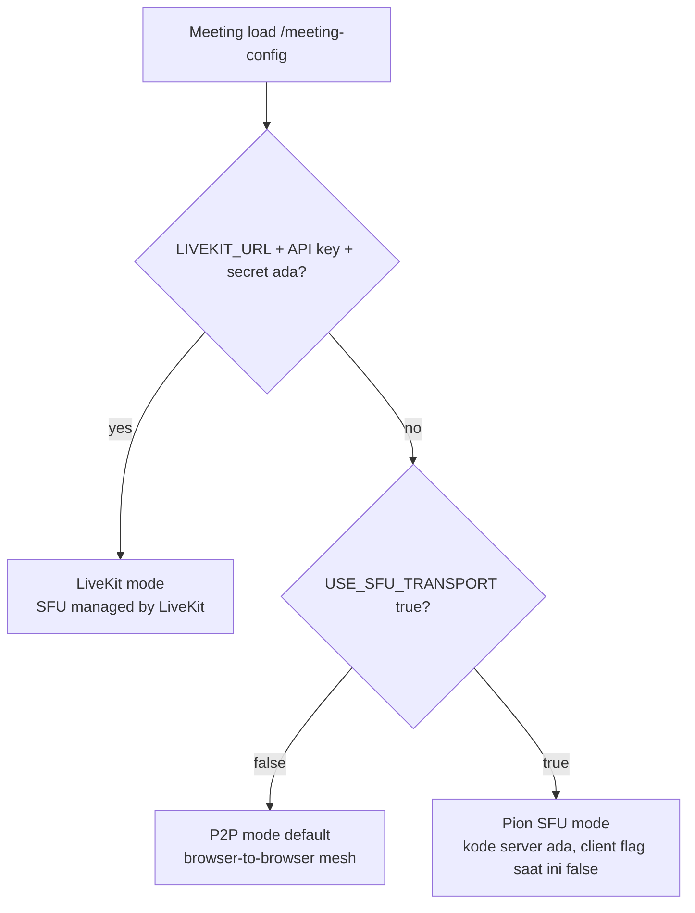

Status saat ini:

- `USE_SFU_TRANSPORT = false` di `js/frontend/meeting.js`, jadi Pion SFU tidak aktif dari client.
- Jika env LiveKit lengkap, `/meeting-config` mengembalikan `transport: "livekit"` dan client memakai LiveKit.
- Jika LiveKit tidak aktif, client memakai P2P mesh.

## 14. Deployment Video Conference

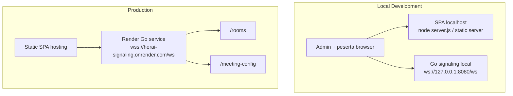

## 15. File Utama

| File | Peran |
| --- | --- |
| `pages/dashboard/video-conference.html` | UI admin untuk generate room, copy link, status signaling, room monitor. |
| `js/dashboard/admin-modules.js` | Logic admin video conference: generate room, connect manual media, monitor `/rooms`, delete room. |
| `pages/frontend/meeting.html` | UI peserta meeting: join, preview, video grid, chat, people, controls. |
| `js/frontend/meeting.js` | Core WebRTC client: media, WebSocket signaling, peer connection, presence, chat, emoji, screen share. |
| `signaling/main.go` | Go server: WebSocket hub, room lifecycle, `/rooms`, `/meeting-config`, `/livekit-token`, optional SFU relay. |
| `render.yaml` | Build dan deploy Go signaling service + public static app ke Render. |
