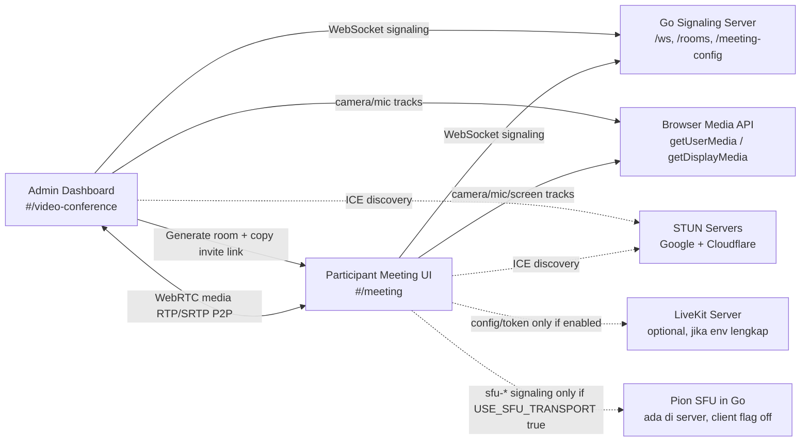
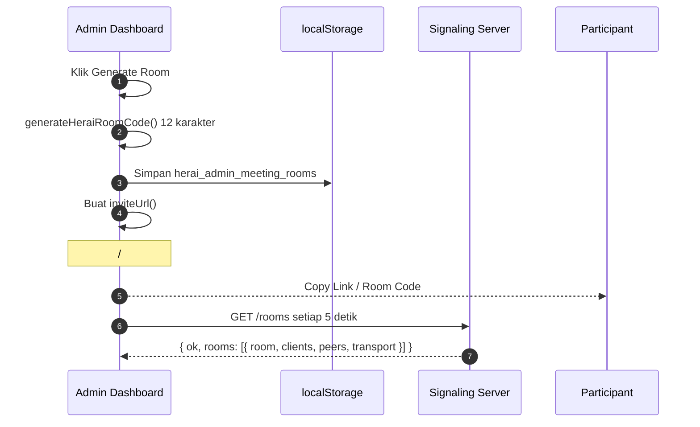
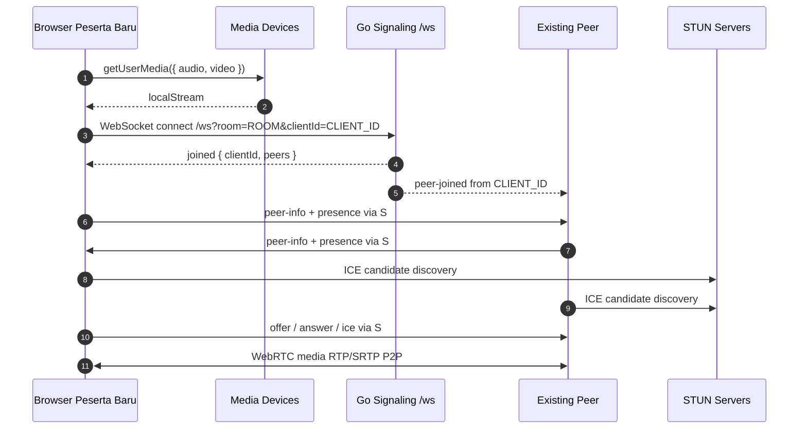
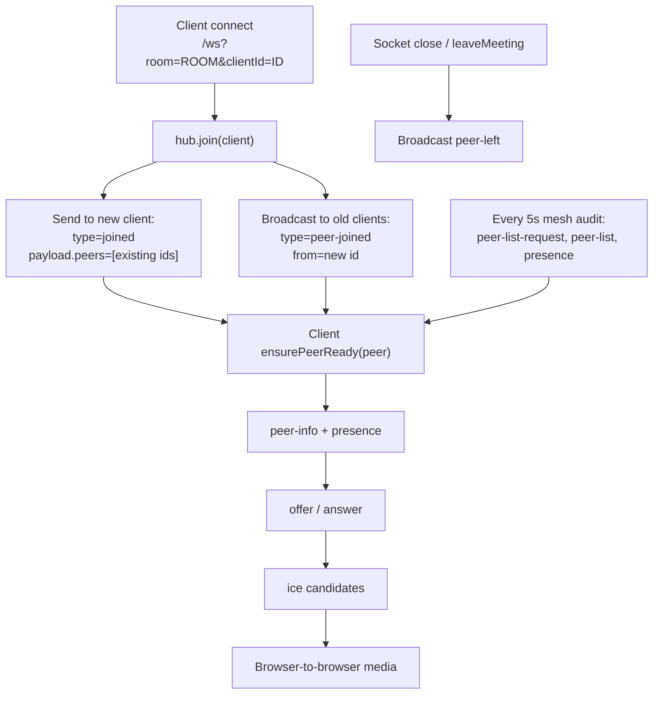
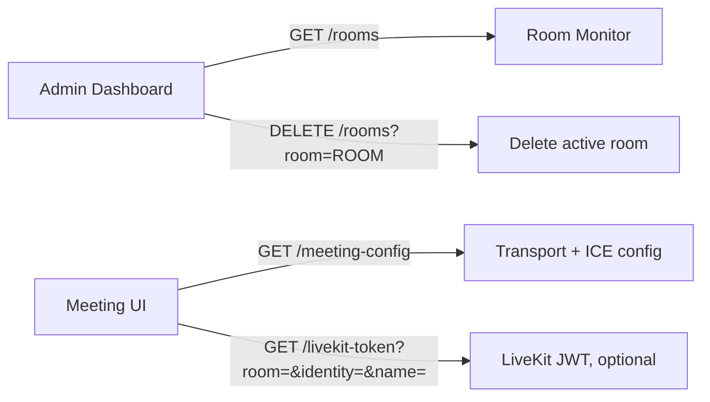

# Video Conference Communication Network

Dokumen ini merangkum alur komunikasi fitur video conference yang sudah ada di HerAI.

## Ringkasan Komponen



Jalur aktif default saat ini adalah **P2P mesh WebRTC**: server Go hanya menyimpan room dan meneruskan pesan signaling, sedangkan audio/video berjalan langsung antar browser.

## Alur Admin Membuat Room



## Alur Peserta Join Room P2P



## Alur Signaling P2P Detail



## Payload WebSocket

Semua pesan WebSocket memakai envelope dasar:

```json
{
  "type": "offer",
  "room": "ABCD-EFGH-JK2M",
  "from": "diisi server dari clientId",
  "to": "target-client-id atau kosong untuk broadcast",
  "payload": {}
}
```

Payload utama yang dipakai client:

| Type | Arah | Payload |
| --- | --- | --- |
| `joined` | server -> client baru | `{ "clientId": "...", "peers": ["peer-id"] }` |
| `peer-joined` | server -> peer lama | kosong, `from` berisi client baru |
| `peer-left` | server -> peer lain | kosong |
| `peer-info` | client -> peer/broadcast | `{ "name": "Nama Tampilan" }` |
| `presence` | client -> peer/broadcast | `{ "id": "...", "name": "...", "mic": true, "camera": true, "hand": false, "screen": false }` |
| `peer-list-request` | client -> server | `{ "name": "Nama Tampilan" }` |
| `peer-list` | server -> client | `{ "peers": ["peer-id"] }` |
| `offer` | client -> peer | `RTCSessionDescription`, contoh `{ "type": "offer", "sdp": "v=0..." }` |
| `answer` | client -> peer | `RTCSessionDescription`, contoh `{ "type": "answer", "sdp": "v=0..." }` |
| `ice` | client -> peer | `RTCIceCandidate`, contoh `{ "candidate": "...", "sdpMid": "0", "sdpMLineIndex": 0 }` |
| `media-reconnect` | client -> peer | `{ "name": "Nama Tampilan" }` |
| `screen-start` | client -> broadcast | `{ "name": "Nama Tampilan", "streamId": "..." }` |
| `screen-stop` | client -> broadcast | `{ "name": "Nama Tampilan" }` |
| `chat` | client -> broadcast | `{ "name": "Nama Tampilan", "text": "pesan", "at": "ISO timestamp" }` |
| `emoji` | client -> broadcast | `{ "emoji": "👍", "name": "Nama Tampilan" }` |
| `room-deleted` | server -> room clients | `{ "message": "Room ditutup oleh admin" }` |

## Endpoint HTTP



Payload HTTP penting:

```json
// GET /meeting-config
{
  "ok": true,
  "transport": "p2p",
  "livekit": { "enabled": false, "url": "" },
  "iceServers": [
    { "urls": "stun:stun.l.google.com:19302" },
    { "urls": "stun:stun1.l.google.com:19302" },
    { "urls": "stun:stun.cloudflare.com:3478" }
  ]
}
```

```json
// GET /rooms
{
  "ok": true,
  "rooms": [
    {
      "room": "ABCD-EFGH-JK2M",
      "clients": 2,
      "peers": ["client-a", "client-b"],
      "transport": "websocket"
    }
  ]
}
```

```json
// GET /livekit-token, jika LIVEKIT_URL/API_KEY/API_SECRET tersedia
{
  "ok": true,
  "url": "wss://livekit.example.com",
  "token": "jwt"
}
```

## Apa Yang Dibangun

- Admin room generator di `#/video-conference`: membuat Room ID 12 karakter, invite link, menyimpan daftar room di `localStorage`, monitor room via `/rooms`, dan bisa delete room aktif.
- Meeting room UI di `#/meeting`: preview kamera/mic, join room, grid video, participants panel, chat, emoji reaction, raise hand, mic/camera toggle, screen share, active speaker indicator, reconnect/watchdog.
- Signaling server Go: WebSocket `/ws`, room hub, broadcast/direct routing, ping/pong, room list `/rooms`, delete room, `/meeting-config`, `/livekit-token`, optional static app serving.
- WebRTC P2P mesh default: setiap peserta membuat `RTCPeerConnection` ke peer lain, memakai STUN untuk ICE, lalu media berjalan langsung antar browser.
- Optional LiveKit path: aktif otomatis kalau env `LIVEKIT_URL`, `LIVEKIT_API_KEY`, dan `LIVEKIT_API_SECRET` tersedia.
- Optional Pion SFU path: server sudah punya handler `sfu-offer`, `sfu-answer`, `sfu-ice`, dan relay RTP track, tetapi client saat ini menyetel `USE_SFU_TRANSPORT = false`.
